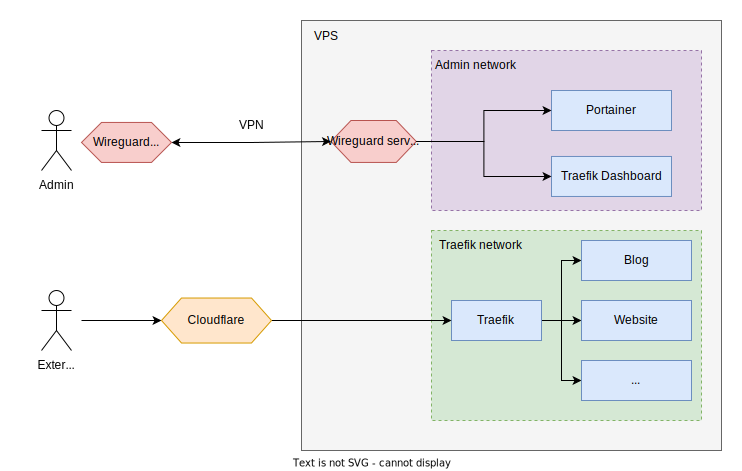

+++
title = "Setting up a VPS using Portainer, Wireguard, Traefik, and Cloudflare"
date = "2023-08-09"
[taxonomies]
tags = ["traefik", "infra"]
+++

# Introduction

Deploying a website can be a hassle. Having to think about security, scalability, maintenance... There are of course ready-to-use solutions that will work perfectly, but if you're like me, and you want to have a more hands on approach, then this article will surely interest you.

Here's how I setup my VPS using [Traefik](https://doc.traefik.io/traefik/) reverse proxy, [Portainer](https://docs.portainer.io), [Wireguard](https://www.wireguard.com) and [Cloudflare](https://www.cloudflare.com/en-gb/) for deploying my personal projects.

> Disclaimer: Some choices I made may not be the best solution for you (or for me 😊). If you're looking for perfection or most optimal solutions you should consider researching the concepts presented here further.

# Overview

This is what we want :



- Any user can get to the Blog and Website
- Only by using the VPN network can you reach the admin services, in this caser Portainer and the traefik dashboard

Services hosted on the VPS are all inside docker containers. Traefik automatically discovers all available services and routes traffic based on routing rules. Portainer manages containers (stopping, restarting...) and makes information available (status, logs...). The portainer and traefik interfaces are only available on the Admin network.

## Technologies

### Wireguard

[Wireguard](https://www.wireguard.com) is a modern VPN server and client, enabling a simple, fast, and secure tunnel between the client devices and the server. Exposing the management interfaces only on the Admin network greatly reduces the attack surface on the VPS.

### Portainer

[Portainer](https://docs.portainer.io) exposes a dashboard that makes it easy to manage docker containers running on the machine. [Installation](https://docs.portainer.io/start/install-ce/server/docker/linux) is really easy using the [portainer-ce](https://hub.docker.com/r/portainer/portainer-ce) docker image.

### Traefik

[Traefik](https://doc.traefik.io/traefik/) makes it easy to expose any dockerized service to the outside world (and much more than that, but we will limit our scope to this feature for this blog post). Simply adding some tags to a docker container will make it available.

### Cloudflare

[Cloudflare](https://www.cloudflare.com/en-gb/) handles DNS management (and optionally registration), but with a **lot** of added [free features](https://www.cloudflare.com/en-gb/plans/free/), such as caching, DDoS protection, SSL certifiacates and much more.

# Configuration

Below is all the configuration for those services. The most basic VPS configuration is not discussed here, there are plenty of resources already for that. You should at least secure your `ssh` configuration and install a firewall.

## Wireguard

Wireguard setup is pretty straightforward, so I will not go into details. You can find the documentation [here](https://www.wireguard.com/quickstart/). I used `10.0.0.0/24` adresses, you can change that to any private IP range you like.

Here is my final **server** configuration, in `/etc/wireguard/wg0.conf` :

```
[Interface]
Address = 10.0.0.1/24
SaveConfig = true
PostUp = ufw route allow in on <WIREGUARD_INTERFACE> out on <VPS_INTERFACE>
PostUp = ufw route allow in on <VPS_INTERFACE> out on <WIREGUARD_INTERFACE>
PreDown = ufw route delete allow in on <WIREGUARD_INTERFACE> out on <VPS_INTERFACE>
PreDown = ufw route delete allow in on <VPS_INTERFACE> out on <WIREGUARD_INTERFACE>
ListenPort = 51820
PrivateKey = aaa...

[Peer]
PublicKey = aaa...
AllowedIPs = 10.0.0.0/24
Endpoint = <IP>:37891
```

`PostUp` and `PreDown` rules enable and disable firewall rules respectively. 

> These rules are for `ufw`, they need to be adapted when using another firewall.

The client configuration should look something like this :

```
[Interface]
PrivateKey = aaa...
Address = 10.0.0.10/24
DNS = 1.1.1.1, 1.0.0.1

[Peer]
PublicKey = aaa...
AllowedIPs = 10.0.0.0/24
Endpoint = <VPS_IP_ADRESS>:51820
```

## Traefik

### Configuration discovery

The traefik configuration is split in several places :

- the `static` configuration : in a file usually called `traefik.yml`, this file contains configuration relative to endpoints, providers, SSL, etc.
- the `dynamic` configuration : contains configuration relative to TLS, routers, etc.
- docker tags : traefik reads all docker tags to discover services from running containers, and get some configuration about itself

You can read more about traefik configuration discovery [here](https://doc.traefik.io/traefik/providers/overview/).

### Target

Using these configuration sources, here is what we want to achieve :

- make all services available from the outside world and automatically discoverable
- make the traefik dashboard available only from our VPN network

Below are the configurations needed ot achieve this target.

### Static configuration

In `/etc/traefik/traefik.yml` :

```yml
entryPoints:
  https:
    address: ":443"

providers:
  file:
    watch:
    filename: "/etc/traefik/config.yml"
  docker:
    watch: true
    exposedByDefault: false

api:
  dashboard: true # enable the dashboard

accessLog: {} # enable access logs
```

- `entryPoints` defines the inputs : we only want HTTPS traffic, so we only enable 443
- `providers` lists the configurations to load : we include the dynamic configuration and the docker provider 
- note that the `insecure` option on `api` is not set (defaults to false)

### Dynamic configuration

In this file we enable routing for the traefik dashboard. Using the `ClientIP` routing rule, all clients coming from inside the VPN network will be able to access the dashboard. We also add a `basicAuth` middleware for added security, that will prompt for username and password when a user attemps to access the daashboard.

```yml
http:
  routers:
    dashboard:
      rule: "ClientIP(`10.0.0.0/24`)"
      service: "api@internal"
      tls: {}
      middlewares:
        - auth
  middlewares:
    auth:
      basicAuth:
        users: "username:$2y$..."
```

> To get the password hash with the correct format, use [`htpasswd`](https://httpd.apache.org/docs/2.4/programs/htpasswd.html).

### docker-compose.yml

Here is the docker compose file to launch traefik.

```yml
version: '3'

services:
  reverse-proxy:
    # The official v2 Traefik docker image
    image: traefik:v2.9
    # Enables the web UI and tells Traefik to listen to docker
    ports:
      # The HTTP port
      - "443:443"
    labels:
      traefik.enable: true
      traefik.http.routers.traefik.entryPoints: "https"
      traefik.http.routers.traefik.tls: true
    restart: always
    volumes:
      # So that Traefik can listen to the Docker events
      - /var/run/docker.sock:/var/run/docker.sock
      - /etc/traefik/traefik.yml:/etc/traefik/traefik.yml:ro
      - /etc/traefik/config.yml:/etc/traefik/config.yml:ro
```

The labels are used by the traefik docker provider. Because we disabled the `exposedByDefault` option, we need to enable traefik manually for all containers that need to be seen.

### Example service docker-compose.yml

Here is an example of a of a simple `docker-compose.yml` for a static website behind an nginx web server :

```yml
version: '3.5'

services:
  example-service:
    build: "/path/to/docker-compose-dir"
    container_name: "example-container"
    networks:
      - "traefik"
    labels:
      traefik.enable: true
      traefik.http.routers.example-router.rule: "Host(`example.com`)"
      traefik.http.routers.example-router.tls: true
      traefik.http.services.example-service.loadbalancer.server.port: 8080

networks:
  traefik:
    name: "traefik_default"
    external: true
```

This example uses the `traefik_default` network, make sure to use the same network as your `traefik` container.

## Cloudflare

Cloudflare handles DNS and certificates for us. You will need to sign up for a free account, and enable Cloudflare for your website.

Setup your DNS records, and set the SSL/TLS encryption mode to "Full", and that's it! You can check out all the other features, especially Security and tweak to your liking.

> If you don't want to use Cloudflare, you can of course use any DNS regstrar you like, but certificates management can get a little complicated depending on API access possibility. Traefik can handle ACME automatic certificate renewal, but some features (like DNS challenge) require API access to the DNS provider, and that is not always a possibility. You can check out the compatibility list [here](https://go-acme.github.io/lego/dns/).

# Conclusion

Hopefully this was helpful to you! Thank you for reading, I hope you have fun building stuff :).